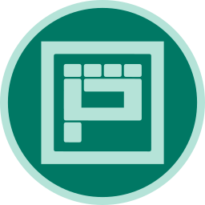
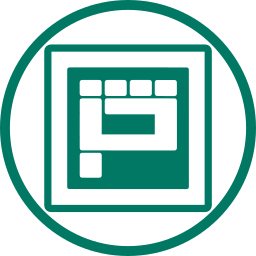
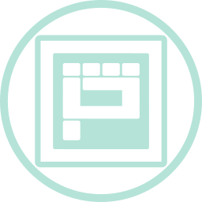
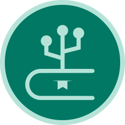
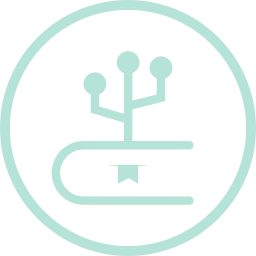
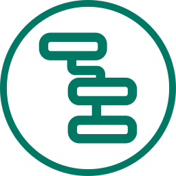
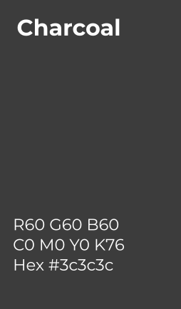
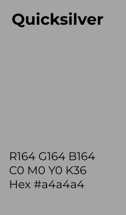
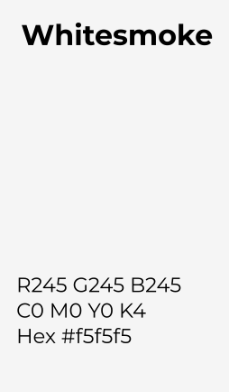

# Branding Guidelines

This repository helps to guide the [OpenPatch](https://openpatch.org) brand. We are always striving to improve the quality of assessment and training of competencies in computer science education. We hope that your and our work pushes everybody to reach their potential. By following these guidelines we hope that you understand our brand right now and how we show up consistently around the world. If you had like to know more or get a clarification, just ask.

## This is Us

OpenPatch is an acronym for Open Platform for Assessment and Training of Competencies, especially in the field of Computer Science. The four letters in **Open** are not only the first you read, but are also the core foundation which we are based on. We believe that education should be available to everybody. Therefore, we focus our work on Open Source making everything we do available to the public.

## Brand Principles

### Put the student first

Everything we do is for the student and must improve their learning. We are not there to judge students, we are not here to look at the students from above, we are here to propel them and inspire them to be a computer scientist.

### Develop in the open

Do not be afraid of putting materials out in the open. Materials are never perfect, we as teachers always find stuff to improve, but keep your materials for yourself is not a solution. We believe that only as a community we can develop the best experience for our students. So put your materials out there and share them with the Computer Science Education community.

### Be a guide not an inspector

Why should a student not have access to every assessment or training material? Hiding material from students, because it could decrease the reliability of an assessment or because they would get to far ahead of everyone else, is something we do not believe in. Students should not be hindered by arbitrary borders. If sparked their interest, we should endorse it and help them to move forward.

### Digital tools can never replace a teacher

Even though we are developing digital tools which might seem to replace teachers like automated assessments. We believe that only a professional trained teacher can create the right environment to foster the learning of students. Therefore, we see digital tools as something to help a teacher to do their job, but never to replace them. We also believe that the communication and the connection between a teacher and a student is one of the most important bits of education.

## Brand Marks

### Wordmark

All applications and colors of the wordmark are shown here. Please do not invent any others.

### Logos

Use the logo when space is limited. Please do not use the logo and workmark together. We are providing two variants of the logo: a plain one and a circled one. Depending on the context the circled one might look better, but the plain one should be tried first. The default color option should be the mixed one.

#### Plain

| Mixed | Dark | Light | Black | White |
| -- | -- | -- |-- | -- |
|  |  |  |  |  |

#### Circle

| Mixed | Dark | Light | Black | White |
| -- | -- | -- |-- | -- |
| |  |  |  |  |

#### Projects

Each project has its own logo. The logos can be used on their own, but should better be used in conjuction with the OpenPatch workmark or logo. For each project logo comes in the same two variations as the main logo.

##### Hyperbook

###### Plain

| Mixed | Dark | Light | Black | White |
| -- | -- | -- |-- | -- |
| |  |  |  |  |

##### Circle

| Mixed | Dark | Light | Black | White |
| -- | -- | -- |-- | -- |
| |  |  |  |  |

##### Bitflow

###### Plain

| Mixed | Dark | Light | Black | White |
| -- | -- | -- |-- | -- |
|  |  |  |  |  |

##### Circle

| Mixed | Dark | Light | Black | White |
| -- | -- | -- |-- | -- |
| |  |  |  |  |

##### Patches

Patches is a special case, since it is only a UI library and most likely not interesting to our main audience, therefore there is only a colorful variant for this project.

| Colorful |
| -- |
|  |

## Color

| OpenPatch Green | Black | White |
| -- | -- | -- |
|  |  |  |
| #007864 | #000000 | #FFFFFF |

|   |  |  |  |  |  |  |
| #004c45 | #b5e3d8 | #242428 | #3c3c3c | #a4a4a4 | #d6d6d6 | #f5f5f5 |

## Typography

Montserrat is our primary type family.

## Developer

### Generate PNG and ICO

You only have to run `bash svg_to_png.sh`. Please be sure that you have
`inkscape` (Version >= 1.0) and `ImageMagick` (Version >= 6 and < 7) installed.
